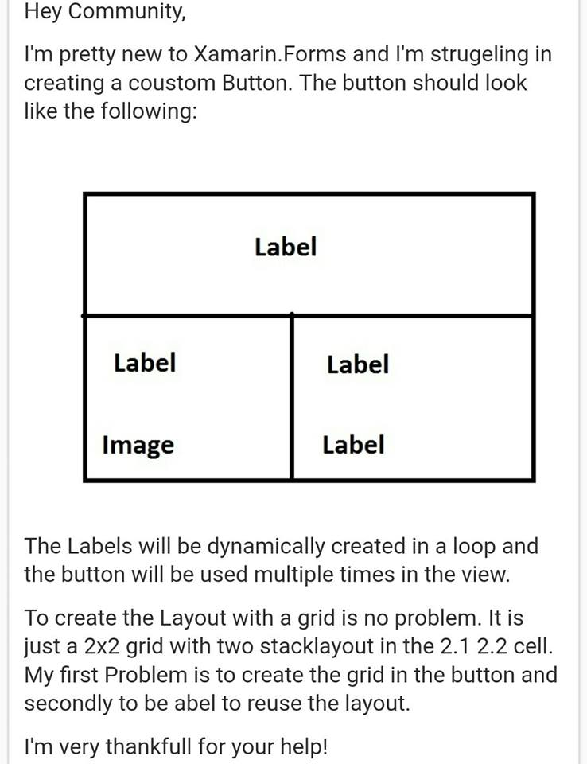

# UserControlChallenge
練習使用 Xamarin.Forms 建立一個客製按鈕，並且可以在 ListView 中來提供服務(可以多次使用)

這是網路上有人提出的一項問題

在這裡，請依照上述圖片中所提出的問題，製作出一個可反覆使用的控制項，並且我們將會在 ListView 中，重複使用該使用者控制項於每筆紀錄中。

該按鈕分成三個區域，每個區域都可以使用手勢觸發不同的命令。

該新建立的控制項，可以透過資料綁定機制，設定這個按鈕的樣貌與行為。

這個練習將會分成底下五個階段逐步設計出來，您可以切換到不同的 Commit ，就可以看到不同的階段的設計專案內容。

* 建立一個客製化按鈕，並且可以重複於頁面中使用

* 建立一個客製化按鈕，並且可以重複於頁面中使用(加入圖片與螢幕截圖)

* 在這裡加入一個按鈕背景顏色可綁定屬性定義，這樣，開發者就可以在 XAML 中，指定這個按鈕所需要的背景顏色

* 可綁定屬性，用於儲存在 XAML 所綁定的當時物件；按鈕的三塊區域，加入觸控觸發的命令；所有的觸發命令，都會定義在頁面 ViewModel 內

* 加入 ListView，並且根據每筆紀錄的狀態不同，設定每筆紀錄的按鈕具有不同的狀態與按鈕背景顏色；該ListView也使用了Behavior加入的點擊觸發的偵測。

